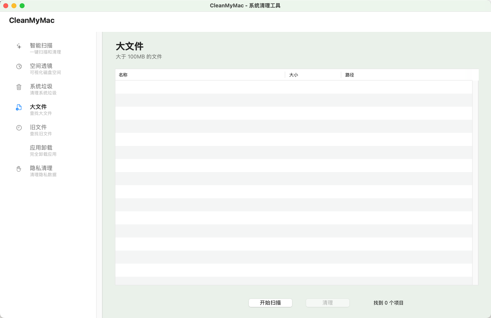

# 空间管理工具 - 需求文档

## 目标
创建一个类似 CleanMyMac 的 macOS 清理工具

## 核心功能模块

### 1. 智能扫描 (Smart Scan)
- [ ] 系统垃圾扫描
- [ ] 照片缓存
- [ ] 邮件附件
- [ ] iTunes 缓存
- [ ] 垃圾桶
- [ ] 大文件和旧文件

### 2. 系统垃圾清理
- [ ] 应用缓存
- [ ] 系统日志
- [ ] 系统缓存
- [ ] 用户缓存
- [ ] 语言文件
- [ ] 开发者垃圾（Xcode、CocoaPods 等）

### 3. 大文件和旧文件
- [ ] 扫描大于指定大小的文件
- [ ] 按文件类型分类
- [ ] 按访问时间排序
- [ ] 预览功能

### 4. 应用卸载器
- [ ] 列出所有已安装应用
- [ ] 完全卸载（包括相关文件）
- [ ] 查找残留文件

### 5. 重复文件查找
- [ ] 基于内容的重复检测（MD5/SHA256）
- [ ] 智能分组
- [ ] 预览和对比

### 6. 隐私保护
- [ ] 浏览器历史清理
- [ ] Cookie 清理
- [ ] 下载历史
- [ ] 最近使用的文件

### 7. 维护工具
- [ ] 修复磁盘权限
- [ ] 验证磁盘
- [ ] 释放 RAM
- [ ] 运行维护脚本

### 8. 实时监控
- [ ] CPU 使用率
- [ ] 内存使用
- [ ] 磁盘空间
- [ ] 网络活动

## UI/UX 设计

### 主界面
- 侧边栏导航（各功能模块）
- 主内容区（扫描结果和操作）
- 顶部状态栏（磁盘空间、系统状态）
- 底部操作栏（扫描、清理按钮）

### 视觉风格
- 现代化、简洁
- 使用渐变和阴影
- 动画过渡
- 深色模式支持

## 技术实现

### 架构
- Swift + AppKit
- MVVM 架构
- 异步扫描（避免阻塞 UI）
- 模块化设计

### 安全性
- 只读扫描
- 清理前确认
- 支持撤销（移到垃圾桶而非直接删除）
- 白名单保护重要文件

### 性能
- 多线程扫描
- 增量更新
- 缓存机制
- 进度显示

## 开发计划

### Phase 1: 基础框架 ✅
- [x] 项目结构
- [x] 基础 UI 框架
- [x] 文件扫描引擎

### Phase 2: 核心功能 ✅
- [x] 系统垃圾扫描
- [x] 大文件查找（已修复：现在使用正确的扫描方法）
- [x] 旧文件查找
- [x] 应用缓存清理
- [x] Space Lens（空间透镜）⭐
- [x] 智能扫描（一键扫描所有类别）
- [x] 统一界面（侧边栏导航）

### Phase 3: 高级功能（进行中）
- [ ] 重复文件检测
- [ ] 应用卸载器（占位符已创建）
- [ ] 隐私清理（占位符已创建）
- [ ] 实际清理功能（目前只有扫描，需要实现真正的清理操作）

### Phase 4: 优化和完善
- [ ] 性能优化
- [ ] UI 美化
- [ ] 错误处理
- [ ] 用户文档

## 当前状态（2026-05-30）

### ✅ 已完成
1. **统一应用框架**：所有功能整合到一个应用中
2. **智能扫描**：一键扫描系统垃圾、大文件、旧文件
3. **Space Lens**：树状图可视化磁盘空间
4. **系统垃圾清理**：扫描系统缓存、日志、临时文件
5. **大文件查找**：扫描 > 100MB 的文件（已修复扫描方法）
6. **旧文件查找**：扫描 > 30 天未使用的文件（> 1MB）
7. **侧边栏导航**：7 个功能模块
8. **表格视图**：显示扫描结果（名称、大小、路径）

### 🔧 需要修复/改进
1. **清理功能**：目前只有扫描，需要实现真正的清理操作
   - 移动文件到废纸篓
   - 批量清理
   - 清理进度显示
   - 清理后刷新列表

2. **应用卸载器**：需要实现
   - 列出已安装应用（扫描 /Applications 和 ~/Applications）
   - 查找应用相关文件（~/Library/Preferences, ~/Library/Application Support 等）
   - 完全卸载功能

3. **隐私清理**：需要实现
   - 浏览器历史（Safari, Chrome, Firefox）
   - Cookie 清理
   - 下载历史
   - 最近使用的文件

### 📋 下一步计划
1. 实现真正的清理功能（移到废纸篓）
2. 实现应用卸载器
3. 实现隐私清理
4. 添加重复文件检测
5. 性能优化和错误处理

## 参考路径

### 常见垃圾文件位置
```
~/Library/Caches/
~/Library/Logs/
~/Library/Application Support/
/Library/Caches/
/Library/Logs/
/System/Library/Caches/
/private/var/folders/
/private/var/log/
```

### 应用相关
```
~/Library/Preferences/
~/Library/Application Support/
~/Library/Saved Application State/
~/Library/Containers/
```

### 开发者垃圾
```
~/Library/Developer/Xcode/DerivedData/
~/Library/Developer/Xcode/Archives/
~/.cocoapods/
~/Library/Caches/CocoaPods/
```

## 注意事项

1. **安全第一**：不要删除系统关键文件
2. **用户确认**：清理前必须让用户确认
3. **可恢复**：优先移到垃圾桶而非永久删除
4. **权限管理**：某些目录需要管理员权限
5. **性能考虑**：大规模扫描要异步处理

## 许可证
MIT License
